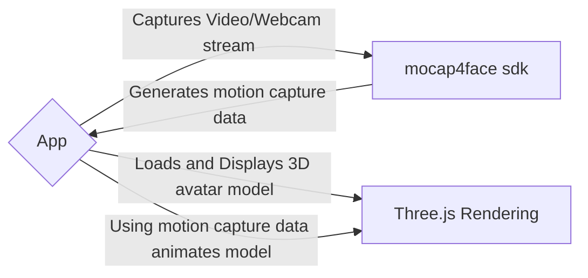

# Welcome to 3D Avatar Application

**Demo** : [3D Avatar Application](https://animated-queijadas-8df0b9.netlify.app/)

3D Avatar application created using [**Alter-core**](https://github.com/facemoji/alter-core), [**mocap4face**](https://github.com/facemoji/mocap4face) and [**three.js**](https://github.com/mrdoob/three.js) sdk. It uses users **webcam** feed , or some **video** for **realtime facial motion capture** based on Facial Action Coding System(**FACS**). It uses **mocap4face** sdk for **motion capture**, the sdk generates **FACS-derived blendshape coefficients**. It uses three.js for rendering our models, (i.e .glb models). The app then uses the motion capture data and changes the face model coefficients.

# Technologies Used

### Frontend

- **React**
- **Typescript**
- **Vite**
- **Tailwind**
- **Alter-core**
- **mocap4face**
- **Three.js**
- **react-three-fiber**

### Why above technologies

- **React + TS + Vite** is the best combination of tech stacks. **React** provides component based architecture and is fast and popular. **Typescript** provides excellent type checking, helps in catching bugs at the time of development. **Vite** is very fast it uses Esbuild. **Esbuild** is written in Go and pre-bundles dependencies 10-100x faster than other JavaScript-based bundlers.
- [**Tailwind**](https://tailwindcss.com/) CSS is a utility-first CSS framework packed with various classes that can be composed to build any design, directly in your markup! It increases development speed drastically and is highly customizable.
- **Alter-core**, **mocap4face** are probably best open source library used in motion capture and 3D avatar rendering.
- **Three.js** is best rendering sdk for browser.

## App Architecture

App only works on client browser. Does not require any use of backend. In the check out the below image. Just uses server to fetch models and other image files.



## Folder Structure


- **Public** - Contains all the static files which are to be served.
- **src** - Contains all the source code. Consists of multiple folder.
  - **assets** - Contains Images and other svg directly imported in the code.
  - **components** - Most important part, contains reusable component.
  - **hooks** - contains reusable react hooks.
  - **utils** - Contains reusable functions.
  - **pages** - Uses components to build pages.
  - **main.tsx** - Root component of the project.

### Components Folder


- Contains All the reusable components.
- Contains for **subdirectory**:
  - **Footer** - Contains Footer.tsx
  - **HeroSection** - Contains the first section of the landing page.
  - **Navbar** - Contains Navbar.tsx component. Used for creating Navbar.
  - **Demo** -
    - Contains 2 subdirectories.
      - **alterCanvas** - Contains code for using alter-core library. Using the library we can use alter's avatar rendering and motion capture system.
      - **threeCanvas** - Most important part of code. Contains code for using mocap4face, three.js and react-three-fiber.
      - **DemoApp.tsx** - **Imports** either **alterCanvas** or **threeCanvas**. Default is threeCanvas. Is imported in App.tsx.
  - **Either** you can **use AlterCanvas or ThreeCanvas**. To change **uncomment the required component in DemoApp.tsx**;

## Running the Development Server

Clone the repository:

```bash
git clone https://github.com/kushakjafry/face-app.git
```

Run the server -

```bash
cd face-expression
npm install
npm run dev
```

Browse to http://localhost:3000/.

### Build and preview the project

Build the project

```bash
npm run build
```

Serve it using

```bash
npm run preview
```

## Demo Images

### THREEJS + MOCAP4FACE Demo


### ALTER CORE DEMO


